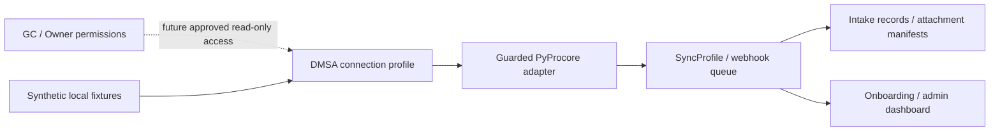

# Procore Intake Bridge

> A read-only DMSA intake service for syncing Procore RFIs, Submittals, visible attachments,
> webhooks, and onboarding workflows into a local tracking system.

<p align="center">
  
  
  
  
  
  
  
</p>

Procore Intake Bridge is a separate backend product layer that uses
[PyProcore](https://pypi.org/project/pyprocore/) as its SDK boundary. It helps subcontractors,
consultants, and engineering teams model controlled, GC/Owner-approved read-only access through a
Developer Managed Service Account (DMSA). The GC or Owner retains control over private-app
installation, projects, tools, permissions, and revocation.

## What it does

- Models DMSA connection profiles using secret references.
- Coordinates project-level sync profiles, watermarks, locks, and run-once polling.
- Stores normalized webhook events for a local database-backed event queue.
- Syncs synthetic RFI/Submittal fixtures into local intake records.
- Plans safe attachment manifests without retaining raw signed URLs.
- Generates local GC/Owner onboarding packet previews and Markdown/JSON exports.
- Provides a minimal read-only local admin dashboard.
- Reports sanitized deployment readiness and startup-safety findings.

## What it does not do

> **Safety boundary:** this project has no Procore write-back behavior.

- It does not create, edit, approve, submit, close, delete, or upload anything in Procore.
- It does not bypass GC/Owner installation, project, or tool permissions.
- It does not store plaintext credentials or raw signed attachment URLs.
- It makes no live Procore calls by default; live mode is disabled explicitly.
- It does not send email or generate PDF/DOCX files.
- It does not provide production authentication or a production deployment guarantee.
- It is not affiliated with, endorsed by, certified by, or supported by Procore Technologies.

## Quick start

Python 3.12 or newer is required.

```bash
python3 -m venv .venv
source .venv/bin/activate
python -m pip install -e ".[dev]"
pytest
uvicorn app.main:app --reload
```

Then open:

- [Health](http://127.0.0.1:8000/health)
- [Readiness](http://127.0.0.1:8000/ready)
- [Local admin dashboard](http://127.0.0.1:8000/admin)
- [OpenAPI documentation](http://127.0.0.1:8000/docs)

SQLite and fixture/mock execution are the local defaults. Copy `.env.example` to an untracked
`.env` only when configuration changes are needed; never commit secrets or private data.

## Safe local demo

The complete fixture-only walkthrough is in [examples/demo-flow.md](examples/demo-flow.md). It
uses synthetic IDs to:

1. Check health and deployment readiness.
2. Create a fake local connection and sync profile.
3. preview sync and polling using dry-run behavior.
4. Inspect the local admin overview.
5. Preview a placeholder-only onboarding packet.

No credentials or live Procore access are required.

## Architecture



Most implemented data flows are local and fixture/mock by default. The guarded adapter can only
construct a live read client after explicit opt-in; it never supplies Procore mutation routes.
See [the architecture document](docs/architecture.md).

## Project status

| Phase | Status | Scope |
|---|---|---|
| A1 | Complete | FastAPI, models, SQLite, fixture intake |
| A2 | Complete | Guarded DMSA credential and SDK boundary |
| A3 | Complete | Sync profiles and run-once polling |
| A4 | Complete | Store-first webhooks and event queue |
| A5 | Complete | Attachment manifests and fixture storage |
| A6 | Complete | Local onboarding packets |
| A7 | Complete | Read-only local admin dashboard |
| A8 | Complete | Deployment hardening structure |
| A9 | Complete | Repository polish and public launch readiness |
| B1 | Complete | Manually gated sandbox DMSA smoke harness |

The current source version is `0.1.0`; no package publication or release tag is implied.

## Manual sandbox smoke harness

B1 adds a CLI-only, disabled-by-default read probe for an approved sandbox DMSA connection. Print
the safe plan without calling Procore:

```bash
python scripts/print_sandbox_smoke_plan.py
```

A real run requires all documented environment gates plus explicit sandbox identifiers and the
exact confirmation phrase:

```bash
python scripts/run_sandbox_dmsa_smoke.py \
  --connection-id 1 \
  --company-id COMPANY_ID_PLACEHOLDER \
  --project-id PROJECT_ID_PLACEHOLDER \
  --confirm "I_UNDERSTAND_THIS_IS_READ_ONLY_SANDBOX_ONLY"
```

It reads at most a small configured sample, downloads no attachments, persists no raw payloads,
and stores no raw URLs. Production is blocked by default. See
[the B1 safety guide](docs/sandbox-smoke-tests.md). Passing it is not a production guarantee.

## Documentation

- [Documentation home](docs/index.md)
- [Architecture](docs/architecture.md)
- [DMSA credential profiles](docs/dmsa-credential-profiles.md)
- [Polling worker](docs/polling-worker.md)
- [Webhooks](docs/webhooks.md)
- [Attachment storage](docs/attachment-storage.md)
- [Onboarding packets](docs/onboarding-packets.md)
- [Admin dashboard](docs/admin-dashboard.md)
- [Deployment hardening](docs/deployment-hardening.md)
- [Operations runbook](docs/operations-runbook.md)
- [Safety model](docs/safety-model.md)
- [Sandbox smoke tests](docs/sandbox-smoke-tests.md)
- [Roadmap](docs/roadmap.md)
- [Public launch checklist](docs/public-launch-checklist.md)

## Quality and safety audits

```bash
make quality
python scripts/audit_public_safety.py
python scripts/audit_routes_read_only.py
```

These checks are safeguards, not proof of production security. Before any real deployment,
resolve all readiness blockers and add independently reviewed authentication, secret management,
database operations, TLS/network controls, audit logging, retention, backup/restore, incident
response, and currently verified webhook/live-read behavior.

## Contributing, security, and support

See [CONTRIBUTING.md](CONTRIBUTING.md), [SECURITY.md](SECURITY.md),
[SUPPORT.md](SUPPORT.md), and [CODE_OF_CONDUCT.md](CODE_OF_CONDUCT.md). Never include real
credentials, customer identifiers, URLs, logs, or project data in an issue or pull request.

## License and disclaimer

Licensed under the [MIT License](LICENSE).

This is an independent open-source project. It is not affiliated with, endorsed by, certified by,
or supported by Procore Technologies, Inc. “Procore” is used only to describe interoperability.
