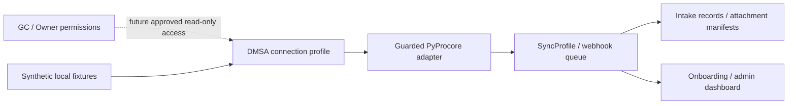

# Procore Intake Bridge

Optional S3, Azure Blob, and GCS storage providers are documented in
[docs/cloud-storage-providers.md](docs/cloud-storage-providers.md). They are disabled by default,
use optional dependencies, and are never contacted by default checks. Start with local storage.

Optional AWS, Azure, and GCP secret providers are documented in
[docs/cloud-secret-providers.md](docs/cloud-secret-providers.md). They are disabled by default,
use optional dependencies, and are never contacted by default checks. Start with `env` or `file`.

## Start with Demo Mode

The repository has three safe paths, kept deliberately separate:

- **Demo Mode** is the default safe path. It uses local synthetic fixtures and requires no Procore
  credentials, secrets, external database, storage setup, deployment, or private workspace.
- **Sandbox Mode** is private and operator-controlled. It requires private DMSA refs, allowed
  company/project scope, and admin authentication. Its friendly check never runs live smoke.
- **Pilot Mode** is private and operator-controlled. It requires a private workspace, evidence
  refs, review/expiry records, approval, deployment/rollback planning, PostgreSQL, secret/storage
  readiness, diagnostics, and an explicit launch hold.

Use Sandbox Mode when you have private Procore sandbox/DMSA credentials. Use Pilot Mode when you
are preparing a controlled private pilot. For a new clone, follow the
**[five-minute quick start](QUICKSTART.md)**:

```bash
python3 -m venv .venv
source .venv/bin/activate
python -m pip install -e ".[dev]"
make start
make try-demo
```

Primary commands:

```bash
make start
make doctor
make try-demo
make prepare-sandbox
make prepare-pilot
make commands
```

Most users should begin with these Make targets. Existing deeper targets and scripts remain
available in the [command reference](docs/command-reference.md). See the
[first-run checklist](docs/first-run-checklist.md), [troubleshooting](docs/troubleshooting.md),
and [usage modes](docs/usage-modes.md).

Continue with the **[guided walkthroughs](docs/walkthrough-index.md)**. The
[Demo walkthrough](docs/walkthrough-demo.md) is the default next document; Sandbox and Pilot
walkthroughs are optional private paths.

The [local documentation-site guide](docs/docs-site.md) and
[navigation map](docs/docs-navigation.md) organize the same Markdown by user journey. MkDocs is
optional, and this repository does not publish or deploy a docs site.

Sandbox operators should use the offline
[smoke execution guide](docs/sandbox-smoke-ux.md) and
[evidence-reference guide](docs/sandbox-smoke-evidence.md). The real read-only smoke command
remains separate, manual, and gated.

F2 adds an independent [Sandbox read-validation guide](docs/sandbox-read-validation.md) and
[private evidence-reference guide](docs/sandbox-read-evidence.md). Its plan, preflight, and
template are offline; the live RFI/Submittal command remains separately enabled and confirmed.

F3 [links opaque Sandbox evidence refs](docs/sandbox-evidence-linkage.md) into private Pilot
planning without reading reports or granting approval. See the
[Sandbox-to-Pilot evidence map](docs/sandbox-evidence-to-pilot.md).

Maintainers preparing a future public release should use the
[release-readiness guide](docs/release-readiness.md). It creates no tag, release, package, image,
publication, or deployment; final approval remains manual.

The mode guides are [Three usage modes](docs/usage-modes.md),
[Demo Mode](docs/quickstart-demo.md), [Sandbox Mode](docs/sandbox-mode.md), and
[Pilot Mode](docs/pilot-mode.md). Operational setup is documented in
[Private workspace](docs/private-workspace-bootstrap.md), [Secret providers](docs/secret-providers.md),
[Storage providers](docs/storage-providers.md), [Database providers](docs/database-providers.md),
and [Deployment recipes](docs/deployment-recipes.md).

Real credentials, customer data, IDs, names, contacts, domains, evidence, approvals, logs,
reports, binaries, backups, generated output, and private workspace files **must not be
committed**. Run `make safety-check` before committing.

## Demo → Sandbox → Pilot

Run `make prepare-sandbox` or `make prepare-pilot` for the selected path. These checks
make no automatic live calls and never approve or deploy a pilot. See the
[guided flow](docs/sandbox-to-pilot-flow.md).

For Sandbox or Pilot secrets, D1 supports a real private environment-variable provider and a
contained local file provider. Start with `make secret-provider-template` and
`make secret-provider-check`; see [Secret providers](docs/secret-providers.md). Demo remains
secret-free, and optional cloud provider contracts are disabled/fail-closed by default.

> A read-only DMSA intake service for syncing Procore RFIs, Submittals, visible attachments,
> webhooks, and onboarding workflows into a local tracking system.

<p align="center">
  
  
  
  
  
  
  
</p>

Procore Intake Bridge is a separate backend product layer that uses
[PyProcore](https://pypi.org/project/pyprocore/) as its SDK boundary. It helps subcontractors,
consultants, and engineering teams model controlled, GC/Owner-approved read-only access through a
Developer Managed Service Account (DMSA). The GC or Owner retains control over private-app
installation, projects, tools, permissions, and revocation.

## What it does

- Models DMSA connection profiles using secret references.
- Coordinates project-level sync profiles, watermarks, locks, and run-once polling.
- Stores normalized webhook events for a local database-backed event queue.
- Syncs synthetic RFI/Submittal fixtures into local intake records.
- Plans safe attachment manifests without retaining raw signed URLs.
- Generates local GC/Owner onboarding packet previews and Markdown/JSON exports.
- Provides a minimal read-only local admin dashboard.
- Reports sanitized deployment readiness and startup-safety findings.

## What it does not do

> **Safety boundary:** this project has no Procore write-back behavior.

- It does not create, edit, approve, submit, close, delete, or upload anything in Procore.
- It does not bypass GC/Owner installation, project, or tool permissions.
- It does not store plaintext credentials or raw signed attachment URLs.
- It makes no live Procore calls by default; live mode is disabled explicitly.
- It does not send email or generate PDF/DOCX files.
- It does not provide production authentication or a production deployment guarantee.
- It is not affiliated with, endorsed by, certified by, or supported by Procore Technologies.

## Quick start

Python 3.12 or newer is required.

```bash
python3 -m venv .venv
source .venv/bin/activate
python -m pip install -e ".[dev]"
pytest
uvicorn app.main:app --reload
```

Then open:

- [Health](http://127.0.0.1:8000/health)
- [Readiness](http://127.0.0.1:8000/ready)
- [Local admin dashboard](http://127.0.0.1:8000/admin)
- [OpenAPI documentation](http://127.0.0.1:8000/docs)

SQLite and fixture/mock execution are the local defaults. Copy `.env.example` to an untracked
`.env` only when configuration changes are needed; never commit secrets or private data.

## Safe local demo

The complete fixture-only walkthrough is in [examples/demo-flow.md](examples/demo-flow.md). It
uses synthetic IDs to:

1. Check health and deployment readiness.
2. Create a fake local connection and sync profile.
3. preview sync and polling using dry-run behavior.
4. Inspect the local admin overview.
5. Preview a placeholder-only onboarding packet.

No credentials or live Procore access are required.

## Architecture



Most implemented data flows are local and fixture/mock by default. The guarded adapter can only
construct a live read client after explicit opt-in; it never supplies Procore mutation routes.
See [the architecture document](docs/architecture.md).

## Project status

| Phase | Status | Scope |
|---|---|---|
| A1 | Complete | FastAPI, models, SQLite, fixture intake |
| A2 | Complete | Guarded DMSA credential and SDK boundary |
| A3 | Complete | Sync profiles and run-once polling |
| A4 | Complete | Store-first webhooks and event queue |
| A5 | Complete | Attachment manifests and fixture storage |
| A6 | Complete | Local onboarding packets |
| A7 | Complete | Read-only local admin dashboard |
| A8 | Complete | Deployment hardening structure |
| A9 | Complete | Repository polish and public launch readiness |
| B1 | Complete | Manually gated sandbox DMSA smoke harness |
| B2 | Complete | Production-shaped secret-provider adapter layer |
| B3 | Complete | Deterministic schema migration hardening |
| B4 | Complete | Secret-backed admin and deployment operator access |
| B5 | Complete | Production-shaped attachment storage provider contract |

The current source version is `0.1.0`; no package publication or release tag is implied.

## Manual sandbox smoke harness

B1 adds a CLI-only, disabled-by-default read probe for an approved sandbox DMSA connection. Print
the safe plan without calling Procore:

```bash
python scripts/print_sandbox_smoke_plan.py
```

A real run requires all documented environment gates plus explicit sandbox identifiers and the
exact confirmation phrase:

```bash
python scripts/run_sandbox_dmsa_smoke.py \
  --connection-id 1 \
  --company-id COMPANY_ID_PLACEHOLDER \
  --project-id PROJECT_ID_PLACEHOLDER \
  --confirm "I_UNDERSTAND_THIS_IS_READ_ONLY_SANDBOX_ONLY"
```

It reads at most a small configured sample, downloads no attachments, persists no raw payloads,
and stores no raw URLs. Production is blocked by default. See
[the B1 safety guide](docs/sandbox-smoke-tests.md). Passing it is not a production guarantee.

## Secret-provider layer

B2 routes DMSA, webhook, local admin-token, and sandbox-smoke resolution through one provider
contract. The environment provider remains the local default; the test provider is in-memory
only, while disabled and external-placeholder providers fail closed. No cloud SDK or real
external secret-manager integration is included.

```bash
python scripts/check_secret_provider.py
```

Database fields store references only, and operational output masks them without returning
values. Production still needs an independently reviewed real secret-manager adapter or external
injection pattern. See [secret management](docs/secret-management.md).

## Database migration hardening

B3 adds a deterministic initial Alembic revision, read-only status, and isolated temporary-SQLite
upgrade/downgrade and schema-drift checks. Startup never runs migrations automatically.

```bash
python scripts/check_migration_status.py
python scripts/run_migration_safety_check.py
python scripts/verify_schema_drift.py
```

Production still requires a verified backup, operator/DBA review, engine-specific testing, and an
approved recovery plan. See [database migrations](docs/database-migrations.md).

## Authenticated admin access

B4 applies one secret-provider-backed header-token guard to all admin HTML/JSON routes and
sensitive deployment operator routes. Local development defaults to `local_optional`;
staging/production readiness requires `token_required`.

```bash
python scripts/check_admin_auth.py
```

Primary and optional rotation refs support controlled token rotation without exposing values or
which token matched. This is interim operator protection, not users, sessions, roles, tenants,
OAuth, or full SaaS authentication. See
[admin authentication](docs/admin-authentication.md).

## Attachment storage providers

B5 adds local, in-memory test, disabled, and fail-closed external-placeholder providers behind one
storage contract. It validates relative object keys, limits object size, reports sanitized health,
and checks local/test manifests without downloading or printing file contents.

```bash
python scripts/check_attachment_storage.py
python scripts/check_attachment_manifest_consistency.py
```

No cloud adapter, cloud SDK, presigned URL, public file-serving route, or live attachment download
is included. See [attachment storage backends](docs/attachment-storage-backends.md).

Phase D2 adds a fail-closed local storage provider plus no-call optional S3, Azure Blob, and GCS
adapter boundaries. Run `make storage-provider-check` and see
[storage providers](docs/storage-providers.md). No public file serving or cloud operation is
enabled.

## Database providers

Demo remains local on SQLite. Sandbox can start with SQLite, while Pilot readiness expects
PostgreSQL configured through a private database URL reference. Run `make database-check`,
`make migration-plan`, and `make backup-restore-plan`; none connects externally or runs a
migration. See [database providers](docs/database-providers.md).

## Deployment recipes

D4 adds placeholder-only Docker, VPS, managed PaaS, and generic-cloud recipe validation. Run
`make deployment-check` and `make https-webhook-checklist`. These tools provision nothing and
make no DNS, TLS, webhook, cloud, database, storage, secret-manager, or Procore calls. See
[deployment recipes](docs/deployment-recipes.md).

## Documentation

- [Documentation home](docs/index.md)
- [Architecture](docs/architecture.md)
- [DMSA credential profiles](docs/dmsa-credential-profiles.md)
- [Polling worker](docs/polling-worker.md)
- [Webhooks](docs/webhooks.md)
- [Attachment storage](docs/attachment-storage.md)
- [Attachment storage backends](docs/attachment-storage-backends.md)
- [Onboarding packets](docs/onboarding-packets.md)
- [Admin dashboard](docs/admin-dashboard.md)
- [Admin authentication](docs/admin-authentication.md)
- [Deployment hardening](docs/deployment-hardening.md)
- [Operations runbook](docs/operations-runbook.md)
- [Safety model](docs/safety-model.md)
- [Sandbox smoke tests](docs/sandbox-smoke-tests.md)
- [Secret management](docs/secret-management.md)
- [Database migrations](docs/database-migrations.md)
- [Roadmap](docs/roadmap.md)
- [Public launch checklist](docs/public-launch-checklist.md)

## Quality and safety audits

```bash
make quality
python scripts/audit_public_safety.py
python scripts/audit_routes_read_only.py
```

These checks are safeguards, not proof of production security. Before any real deployment,
resolve all readiness blockers and add independently reviewed authentication, secret management,
database operations, TLS/network controls, audit logging, retention, backup/restore, incident
response, and currently verified webhook/live-read behavior.

## Contributing, security, and support

See [CONTRIBUTING.md](CONTRIBUTING.md), [SECURITY.md](SECURITY.md),
[SUPPORT.md](SUPPORT.md), and [CODE_OF_CONDUCT.md](CODE_OF_CONDUCT.md). Never include real
credentials, customer identifiers, URLs, logs, or project data in an issue or pull request.

## License and disclaimer

Licensed under the [MIT License](LICENSE).

This is an independent open-source project. It is not affiliated with, endorsed by, certified by,
or supported by Procore Technologies, Inc. “Procore” is used only to describe interoperability.
## Phase B6: webhook production verification harness

B6 adds a disabled-by-default, CLI-only synthetic verification harness. It checks current
manual documentation assumptions plus local receiver, normalizer, deduplication, and queue
behavior. It never calls Procore, registers hooks, exposes an endpoint, or includes raw
payloads or real webhook secrets in reports.

```bash
make webhook-verification-plan
make webhook-docs-check
```

See [Webhook production verification](docs/webhook-production-verification.md). Actual
production webhook creation remains a future, explicitly approved write-scope phase.
## Phase B7: customer-specific deployment pattern

B7 adds a local-only customer deployment profile validator and sanitized checklist/runbook
generator. It uses fake examples and secret references, writes only ignored local artifacts, and
does not deploy infrastructure, connect services, call Procore, or expose webhooks.

```bash
make customer-template
make customer-profile-check
make customer-artifact-check
```

See [Customer-specific deployment pattern](docs/customer-deployment-pattern.md). Real deployment
automation remains future, separately reviewed work.
## Phase B8: operator diagnostics and support bundles

B8 adds strict local diagnostics, a protected read-only summary route, and sanitized local support
bundles. It includes aggregate posture and counts only—never raw logs, database files,
attachments, payloads, environment values, local paths, or credentials.

```bash
make diagnostics
make support-bundle
make support-bundle-check
```

See [Operator diagnostics](docs/operator-diagnostics.md). No external observability, telemetry,
monitoring service, or production deployment behavior is implemented.
## Phase B9: pilot readiness gate

B9 adds a local-only, fail-closed `GO` / `NO_GO` / `NEEDS_REVIEW` / `BLOCKED` gate using fake
profiles and evidence references. It does not deploy, call Procore, expose webhooks, or approve a
real pilot.

```bash
make pilot-template
make pilot-readiness-check
make pilot-artifact-check
```

See [Pilot readiness gate](docs/pilot-readiness-gate.md). A `GO` is not production deployment
approval; real execution remains separately controlled.

## Phase C1: private pilot evidence workspace

C1 adds strict placeholder-only evidence manifests, offline safety validation, and an ignored
local workspace scaffold. It collects no evidence, reads no evidence files, and makes no Procore
or external calls. Real evidence must remain in an approved private system outside GitHub.

```bash
make evidence-template
make evidence-manifest-check
make evidence-workspace-check
```

See [Private pilot evidence](docs/private-pilot-evidence.md).

## Phase C2: evidence review and expiry

C2 adds local placeholder-only review status, bounded expiry checks, renewal checklists, and
ignored review artifacts. It records no real reviewer or signoff, sends no notifications, and
makes no Procore or external calls.

```bash
make evidence-review-template
make evidence-review-check
make evidence-expiry-check
make evidence-review-artifact-check
```

See [Evidence review and expiry](docs/evidence-review-expiry.md).

## Phase C3: private pilot approval packet

C3 combines B9/C1/C2 placeholder references with launch, rollback, limitation, risk, and signoff
templates. It creates no real approval, contacts nobody, and makes no Procore or external calls.

```bash
make pilot-approval-template
make pilot-approval-check
make pilot-approval-safety-check
make pilot-approval-artifact-check
```

See [Private pilot approval packet](docs/pilot-approval-packet.md).

## PostgreSQL runtime operations

SQLite remains the Demo default. For private Sandbox/Pilot PostgreSQL planning, run
`make postgres-runtime-check`, `make postgres-migration-plan`, and
`make postgres-backup-restore-plan`. These commands are offline and neither connect nor operate on
a database. Live connectivity and migration-status commands are separate, disabled by default,
manually gated, and sanitized. See
[PostgreSQL runtime operations](docs/postgres-runtime-operations.md).
