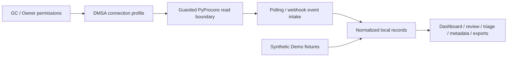

<div align="center">

<h1>Procore Intake Bridge</h1>

<p>
  A local-first, read-only intake workspace for reviewing Procore RFIs, Submittals,
  attachment metadata, lifecycle status, and triage signals without writing back to Procore.
</p>

<p>
  
  
  
  
  
</p>

</div>

Procore Intake Bridge is an independent open-source application for GC and Owner teams that want a
controlled local review surface around their Procore intake. PyProcore is the SDK boundary, while
connection profiles express the DMSA permissions and project scope controlled by the GC or Owner.
Demo Mode works entirely with synthetic local data. Live or private access is a separate, manually
gated path. Live mode is disabled by default and is never enabled by the default configuration.
The three usage modes are Demo Mode, Sandbox Mode, and Pilot Mode.

## Why this exists

Project teams receive RFIs, Submittals, attachment metadata, and status changes across many Procore
projects. Reviewing that intake can become fragmented across inboxes, spreadsheets, and separate
operator tools.

This application provides a local review workspace for normalized intake records, local lifecycle
state, triage signals, and metadata-only attachment review. It keeps the system of record and its
permissions authoritative: the application does not add Procore write-back behavior.

## What you can do

- Seed deterministic synthetic RFI and Submittal records into local SQLite for a repeatable Demo.
- Review local intake records in a product dashboard and an Intake Review Workspace.
- Use local lifecycle statuses and history to organize review work without updating Procore.
- Inspect a read-only Operator Triage Queue with bounded filters and deterministic sorting.
- Review attachment manifests as metadata only; attachment contents and public file serving are out of scope.
- Generate sanitized JSON, Markdown, and CSV summaries through local commands rather than download routes.
- Exercise polling and webhook event-queue foundations with local fixtures and run-once commands.
- Define DMSA connection profiles with secret references and permitted project scope.
- Produce local onboarding packet previews and exports for review.
- Inspect local API/OpenAPI documentation, diagnostics, readiness, and safety checks.

Demo-ready behavior is local and synthetic. Sandbox reads are private and manually gated. Pilot and
hosted use require separate private evidence, infrastructure, security, and operational review.
Live Procore synchronization is not enabled by default.

## Product tour

| Surface | Purpose | Boundary |
| --- | --- | --- |
| [Product Dashboard](http://localhost:8000/dashboard) | Aggregate local counts, review status, triage signals, attachment summaries, and next steps. | Local database; read-oriented; admin guard. |
| [Intake Review Workspace](http://localhost:8000/review) | Browse RFI and Submittal records, details, priority signals, and local history. | Local records; admin guard. |
| [Triage Queue](http://localhost:8000/review/triage) | Sort and filter bounded operator triage signals. | Read-only projection; no assignment or Procore update. |
| Lifecycle controls | Record a guarded local status transition and view its history. | Local lifecycle mutation only; no Procore write-back. |
| Attachment metadata review | Inspect sanitized manifest fields and attachment counts. | Metadata only; no content processing or public file serving. |
| Admin and deployment views | Review local system summaries, safety posture, and readiness metadata. | Protected operational views; the admin-token boundary is not full SaaS authentication. |

## Five-minute local demo (Quick Start)

The following is the canonical local path. It uses only repository code, synthetic fixtures, and a
local SQLite database.

```bash
git clone https://github.com/vibhanshu-mishra/procore-intake-bridge.git
cd procore-intake-bridge

python3 -m venv .venv
source .venv/bin/activate
python -m pip install -e ".[dev]"

make first-run
make demo-seed
make start
uvicorn app.main:app --reload
```

Open these local pages after the server starts:

- [Product dashboard](http://localhost:8000/dashboard)
- [Intake review workspace](http://localhost:8000/review)
- [Admin dashboard](http://localhost:8000/admin)
- [OpenAPI docs](http://localhost:8000/docs)
- [Health](http://localhost:8000/health) and [readiness](http://localhost:8000/ready)

Demo Mode requires no Procore credentials, no cloud service, and no external database. It uses
synthetic records and local SQLite. `make demo-reset CONFIRM="RESET DEMO DATA"` resets only
deterministic Demo-marked records; it does not reset private workspaces or customer data.

## Usage modes

| Mode | Data | Credentials | External calls | Intended use |
| --- | --- | --- | --- | --- |
| Demo | Synthetic local fixtures and SQLite | None | None | Local evaluation and UI walkthroughs |
| Sandbox | A private Procore sandbox and scoped local records | Private DMSA references and project scope | Only through a separately enabled, manually gated read-only check | Controlled validation |
| Pilot | A private workspace with evidence, approval, rollback, database, secret, and storage review | Private, reviewed configuration | Separately authorized; not automatic | Private operational preparation |
| Hosted preparation | Templates, matrices, and review checklists | Private review inputs | None from this repository | Planning a future deployment; not an operating mode |

See [usage modes](docs/usage-modes.md) for the boundaries between Demo, Sandbox, and Pilot.
These are the three safe paths; hosted preparation is planning material, not a fourth operating
mode. Use `make prepare-sandbox` or `make prepare-pilot` only when private review is in scope.

## Architecture



Procore permissions remain authoritative. The bridge owns connection-profile boundaries, local
normalization, sync state, intake records, lifecycle state, triage projections, attachment
manifests, and local review output. Demo fixtures enter the same local intake path without Procore.
The application has no Procore mutation routes. Read [the architecture guide](docs/architecture.md)
for the service and data boundaries.

## Safety boundaries

- No Procore write-back routes.
- No public attachment file-serving routes.
- No public export-download routes; exports are generated locally.
- No plaintext credential storage in tracked files; use secret references outside Git.
- No live Procore calls by default; fixture mode is the default.
- GC/Owner permissions remain authoritative for any private connection.
- Attachment review is metadata-only, and local lifecycle state does not update Procore.
- Real credentials, customer data, private URLs, identifiers, logs, and reports must stay outside Git and must not be committed.
- Private Sandbox, Pilot, and hosted use require separate human review.
- This is an independent project and is not affiliated with or endorsed by Procore Technologies.

## Current limitations

- There is no notification or alerting system.
- A full immutable audit-log implementation is not provided.
- Automatic retention enforcement is not provided.
- Application-level encryption-at-rest behavior is not implemented here.
- The project makes no privacy, legal, regulatory, or security-compliance claim.
- Hosted UI and deployment remain preparation and planning, not a deployed service.
- Private security, infrastructure, legal, privacy, and operational review is required before live use.
- Live Procore Sandbox validation remains separately gated.

See the [known-limitations register](docs/known-limitations-register.md), [security gap closeout](docs/security-gap-closeout.md), and [post-release roadmap](docs/post-release-roadmap.md) for the maintained detail.

## Common commands

| Command | Purpose |
| --- | --- |
| `make first-run` | Print local onboarding, doctor, and next-step guidance. |
| `make start` | Print the safe local start summary and readiness guidance. |
| `make try-demo` | Run the fixture-only Demo walkthrough. |
| `make demo-seed` | Seed deterministic Demo-marked records in local SQLite. |
| `make demo-data-check` | Verify the Demo inventory and safety boundaries. |
| `make demo-reset CONFIRM="RESET DEMO DATA"` | Reset only confirmed Demo-marked records. |
| `make doctor` | Print sanitized local mode and configuration posture. |
| `make quality` | Run the complete offline developer checks. |
| `make safety-check` | Run public usability, safety, and route audits. |
| `make api-docs-review` | Review the local FastAPI route surface without invoking routes. |
| `make final-readiness` | Run the final offline public-repository review. |
| `make release-readiness` | Review prepared release boundaries without publishing anything. |

The [command reference](docs/command-reference.md) covers the remaining local and separately gated
commands. Friendly commands are local-only; advanced live-read and infrastructure checks are not
part of onboarding or `make quality`.

## Documentation

**Start** — [Quickstart](QUICKSTART.md), [local installer](docs/local-installer-guide.md),
[usage modes](docs/usage-modes.md), [Demo walkthrough](docs/quickstart-demo.md),
[guided walkthrough index](docs/walkthrough-index.md), and [local docs-site guidance](docs/docs-site.md).

**Product** — [Product Dashboard](docs/product-dashboard.md), [Intake Review Workspace](docs/intake-review-workspace.md),
[lifecycle flow](docs/intake-lifecycle-status-flow.md), [triage queue](docs/operator-triage-queue.md),
[attachment review](docs/attachment-review-manifest-ux.md), and [operator export pack](docs/operator-export-pack.md).

**Developer and API** — [architecture](docs/architecture.md), [API route reference](docs/api-route-reference.md),
[local OpenAPI guide](docs/openapi-local-guide.md), and [command reference](docs/command-reference.md).

**Private operations** — [Sandbox mode](docs/sandbox-mode.md), [Pilot mode](docs/pilot-mode.md),
[private workspace](docs/private-workspace-bootstrap.md), [secret providers](docs/secret-providers.md),
[storage providers](docs/storage-providers.md), [database providers](docs/database-providers.md),
and [deployment recipes](docs/deployment-recipes.md).

**Security and release** — [safety model](docs/safety-model.md), [security gap closeout](docs/security-gap-closeout.md),
[known limitations](docs/known-limitations-register.md), [post-release roadmap](docs/post-release-roadmap.md),
[future-work backlog](docs/future-work-backlog.md), [private-review backlog](docs/private-review-backlog.md),
[pre-tag reminders](docs/pre-tag-reminder-checklist.md),
[release readiness](docs/release-readiness.md), [maintainer handoff](docs/maintainer-handoff.md),
[maintainer quickstart](docs/maintainer-quickstart.md), [maintainer review checklist](docs/maintainer-review-checklist.md),
and [project status](docs/project-status.md).

## Project status

- Current source version: `0.1.0`. Published versions are listed in GitHub Releases.
- Demo Mode is available locally with deterministic synthetic data.
- Product dashboard, review, triage, lifecycle, attachment-metadata, and local export UX are implemented locally.
- Live Sandbox reads are manually gated and separately reviewed.
- Pilot and hosted preparation require private review and are not automatically approved.

## Contributing and support

Read [CONTRIBUTING.md](CONTRIBUTING.md), [SECURITY.md](SECURITY.md), [SUPPORT.md](SUPPORT.md),
and the [Code of Conduct](CODE_OF_CONDUCT.md). Do not include customer data, credentials, private
URLs or IDs, logs, reports, or attachment contents in issues or pull requests.

## License and independence

This project is released under the [MIT License](LICENSE). 

Procore Intake Bridge is an independent
open-source project, not affiliated with, endorsed by, certified by, or supported by Procore
Technologies. “Procore” is used only to describe interoperability.
