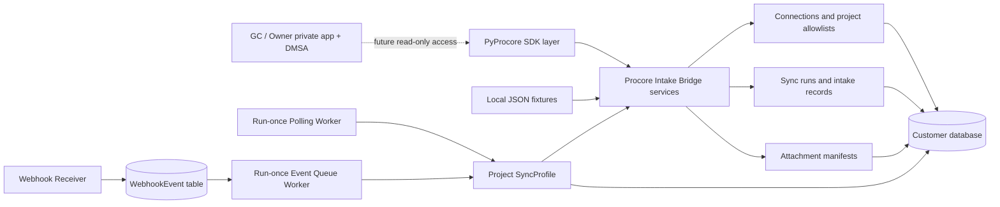

# Architecture

Procore Intake Bridge is a separate hosted backend, not an extension of the SDK.

PyProcore owns OAuth and token refresh, HTTP requests, pagination, retries, typed response parsing,
and attachment download plumbing. The Bridge owns customer connection profiles, DMSA onboarding
state, permitted-project enforcement, health reporting, polling/webhook strategy, normalization,
sync state, intake records, attachment manifests, and operational logs.

In Phase A2, fixtures to Bridge to SQLite remains the only sync path. The Procore path is limited
to an opt-in, read-only health diagnostic. `build_pyprocore_client_for_connection` raises
`LiveProcoreDisabledError` unless the explicit live flag is true. Credential resolution and the
PyProcore constructor remain centralized in the adapter.

The data model separates DMSA connections, sync-run history, normalized intake records, and
attachment metadata. `SyncProfile` adds project-level schedules, watermarks, locks, and retry
state. The run-once Polling Worker selects due profiles and calls the same intake service; there is
no background daemon or external queue. A source/project/item uniqueness constraint supports
idempotent re-syncs.

The A4 webhook receiver stores events only: it never calls Procore or invokes sync in the request
path. The database-backed Event Queue Worker later locks queued events, maps them to `SyncProfile`,
and triggers the existing fixture/mock intake path. Polling remains the fallback reconciliation
mechanism.
