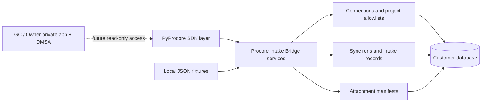

# Architecture

Procore Intake Bridge is a separate hosted backend, not an extension of the SDK.

PyProcore owns OAuth and token refresh, HTTP requests, pagination, retries, typed response parsing,
and attachment download plumbing. The Bridge owns customer connection profiles, DMSA onboarding
state, permitted-project enforcement, health reporting, polling/webhook strategy, normalization,
sync state, intake records, attachment manifests, and operational logs.

In Phase A1, the solid execution path is fixtures to Bridge to SQLite. The future Procore path is
conceptual and guarded. `build_pyprocore_client_for_connection` raises `LiveProcoreDisabled`, and
list operations reject any mode other than `fixture`.

The data model separates DMSA connections, sync-run history, normalized intake records, and
attachment metadata. A source/project/item uniqueness constraint supports idempotent re-syncs.
